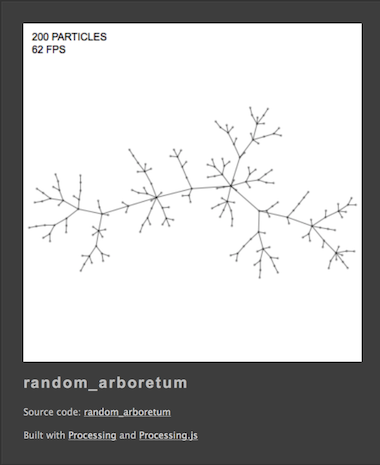

# Traer Physics for *Processing.js*

These are the *Traer Physics Examples* ported to *Processing.js*  
They should run inside the Processing IDE — both in Java and Javascript mode.

# Examples

# History

- Based on the original processing plugin by Jeff Traer
- Ported to *Processing.js* by Mike Niemi — see [here](http://svbreakaway.info/tp-downloads.php)
- Improvements by Mike Niemi and Carl Paerson 
- Original example ported by Martin Schneider

# License

*Use this code for whatever you want, just send me a link jeff@traer.cc*

# TODO

Help me port the other examples! They can be found [here](https://github.com/bitcraftlab/traer-physics/tree/master/examples).
